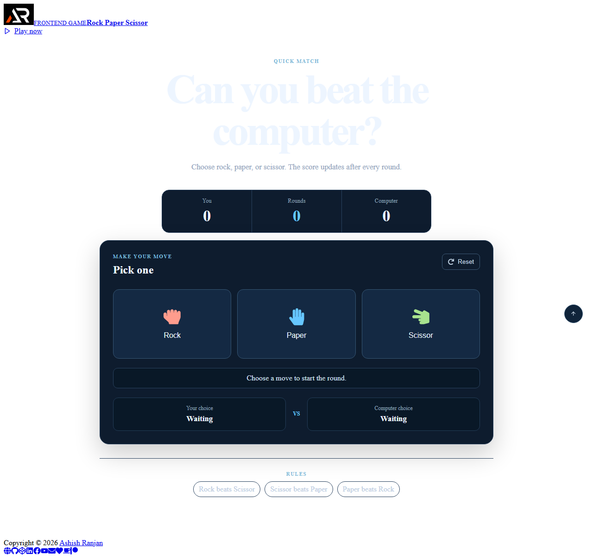

# Rock Paper Scissor

A responsive React game where you play Rock Paper Scissor against a randomly choosing computer opponent.



## Features

- Rock, Paper, and Scissor choices with icon-based controls.
- Player and computer scores with round count.
- Live round result and current choices.
- Reset button and concise rules panel.`n- Small-screen menu and floating back-to-top control.
- Responsive fixed header and icon-only footer links.

## Tech stack

React, Create React App, Sass modules, Material UI, and React Icons.

## Run locally

```bash
npm install
npm start
```

Create a production build with `npm run build` and deploy with `npm run deploy`.

## Live

[Open the live game](https://a2rp.github.io/rock-paper-scissor/)

## Links

- Portfolio: [https://www.ashishranjan.net](https://www.ashishranjan.net)
- GitHub: [https://github.com/a2rp](https://github.com/a2rp)
- CodePen: [https://codepen.io/ash1198](https://codepen.io/ash1198)
- LinkedIn: [https://www.linkedin.com/in/aashishranjan](https://www.linkedin.com/in/aashishranjan)
- Facebook: [https://www.facebook.com/theash.ashish/](https://www.facebook.com/theash.ashish/)
- YouTube: [https://www.youtube.com/@ashishranjan-ashz?sub_confirmation=1](https://www.youtube.com/@ashishranjan-ashz?sub_confirmation=1)
- Email: [ash.ranjan09@gmail.com](mailto:ash.ranjan09@gmail.com)

## Support

- Support: [https://a2rp-donation-page.netlify.app/](https://a2rp-donation-page.netlify.app/)
- Buy Me a Coffee: [https://buymeacoffee.com/a2rp](https://buymeacoffee.com/a2rp)
- Patreon: [https://patreon.com/a2rp](https://patreon.com/a2rp)
